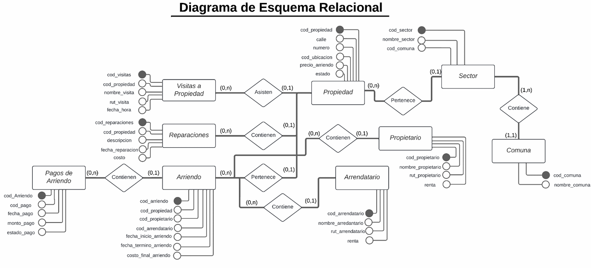

# Laboratorio 2 Base de datos Finis Ferrae

<h3>Base de Datos para Corredor de Propiedades</h3>

Este repositorio contiene el desarrollo de un sistema de gestión de base de datos relacional para un corredor de propiedades, diseñado e implementado en SQL Server y MySQL. El objetivo principal del proyecto es optimizar la gestión de información relacionada con propiedades, arriendos, propietarios, arrendatarios, reparaciones y otros aspectos clave del negocio inmobiliario.

## 📋 Características

- **Esquema Relacional Normalizado:** Diseño en Primera, Segunda y Tercera Forma Normal (1FN, 2FN, 3FN) para asegurar integridad y evitar redundancias.
- **Consultas Personalizadas:** Consultas para obtener información específica como pagos pendientes, propiedades en reparación y contratos activos.

## 📑 Contenido del Informe Lab 2

1. **Introducción:** Descripción del problema y objetivos del sistema.
2. **Código de SQL Server y MySQL**

   2.1 **SQLServerMicrosoft**
   
   2.1.1 **Creacióndebasededatos**
   
   2.1.2 **CreacióndeTablas**
   
   2.1.3 **Insercióndedatos**

   2.2 **MySQL**
   
   2.2.1 **Creacióndebasededatos**
   
   2.2.2 **CreacióndeTablas**
   
   2.2.3 **Insercióndedatos**
   
3. **ModeloEsquemaRelacional**
4. **ConsultasSQLSimples**
   
   4.1 **ConsultasdeSQLServerMicrosoft**
   
   4.2 **ConsultasdeMySQL**
   
5. **ConsultasSQLAnidadas**

   5.1 **ConsultasdeSQLServerMicrosoft**
   
   5.2 **ConsultasdeMySQLAnidadas**
   
7. **DiferenciasentreSQLNetworkyMySQL**

   6.1 **AdaptacionesRealizadas**
   
8. **Conclusión**

## 🛠️ Tecnologías Utilizadas

- **SQL Server:** Implementación del sistema de base de datos SQL Server.
- **MySQL:** Implementación del sistema de base de datos MySQL.


## 🚀 Funcionalidades

### Diagrama de Esquema Relacional


### Consultas Ejemplares
Contiene 20 consultas simples y 15 consultas anidadas, las cuales son para cada SGBD ver diferencias entre SQL Server y MySql

## 📂 Estructura del Proyecto

```
├── README.md
├── Lab 2 Bases de Datos.pdf        # Informe de Laboratorio 1
├── Lab2_Base de Datos.sql        # Archivo de base de datos Access
```

## 👥 Autores

- Miguel Cornejo
- Nicolás Arellano
- Benjamín Sepúlveda Labbe
- Guillermo Guiñez

## 🗓️ Fecha de Entrega
27 de Octubre de 2024


## ⚠️ Advertencia y Licencia

Este proyecto ha sido desarrollado con fines educativos para ilustrar conceptos y técnicas en el diseño de bases de datos. **No se autoriza el uso directo de este material para implementaciones reales sin una evaluación técnica y contextual adecuada.**

### Términos de Uso
1. Los autores no se hacen responsables por el uso indebido, modificaciones o riesgos asociados derivados de este proyecto.
2. Este repositorio está disponible públicamente para promover el aprendizaje. Si se utiliza como base para otros trabajos, **se debe dar el debido crédito a los autores originales citando este repositorio como referencia.**
3. Cualquier implementación que derive de este código o diseño debe cumplir con los estándares éticos y legales aplicables en el contexto de uso.

Se recomienda estudiar el código y adaptar cualquier implementación según las necesidades específicas, siempre evaluando su viabilidad y seguridad.
